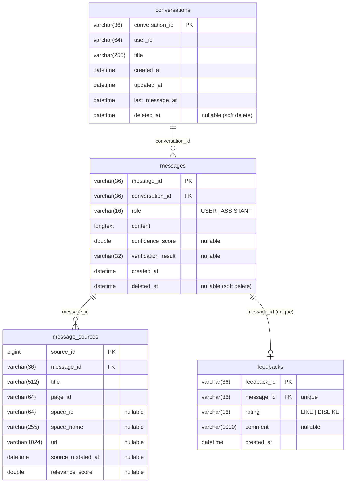

# DB Schema

> 기준: 2단계 BFF Server 핵심 API (중간발표, 인증 없음)
> 저장소: MySQL 8.x (정형 데이터). MongoDB/Vector DB는 본 문서 범위 밖.
> 규칙: `docs/conventions.md` §11 (snake_case 컬럼, 복수형 테이블, FK·인덱스 목적 문서화).

---

## 1. 적용 결정 (확정)

| 항목 | 결정 | 근거 |
|---|---|---|
| 삭제 방식 | **soft delete** — `conversations.deleted_at`, `messages.deleted_at`. 모든 조회는 `deleted_at IS NULL` 필터 | 연결된 피드백·QCA 데이터 보존 (`current-plan.md` 확정된 결정 #2) |
| 피드백 재등록 | **메시지당 1건** — `uniq_feedbacks_message (message_id)`. 같은 메시지 재요청 시 기존 row upsert (신규 201 / 갱신 200) | `current-plan.md` 확정된 결정 #1 |
| ID 전략 | 대화/메시지/피드백 PK는 애플리케이션 생성 UUID(`VARCHAR(36)`). `message_sources`만 `BIGINT AUTO_INCREMENT` | UUID는 분산 생성·노출 안전, 출처는 종속 엔티티라 surrogate key로 충분 |
| 시간 컬럼 | `DATETIME(6)` UTC 저장. JPA는 `java.time.Instant`로 매핑 (API ISO-8601 `Z` 표기와 일치) | `docs/api-spec.md` 응답 포맷 |
| 답변 본문 | `messages.content`는 `LONGTEXT` (긴 RAG 답변 저장) | `current-plan.md` 위험 요소 — 길이 초과 방지 |

> **JPA 매핑 노트:** FK는 본 문서의 MySQL DDL에서 제약으로 강제한다. Entity는 계층 단순성과 Virtual Thread 친화성을 위해 `@ManyToOne` 연관 대신 FK 컬럼(`conversation_id`, `message_id`)을 평문 컬럼으로 보유한다. 따라서 테스트용 H2(엔티티 기반 `ddl-auto`)에는 FK 제약이 생성되지 않으며, 운영 MySQL 스키마는 본 DDL을 단일 기준으로 한다.

---

## 2. ERD



---

## 3. 테이블 DDL (MySQL 8.x)

### 3.1 `conversations`

```sql
CREATE TABLE conversations (
    conversation_id  VARCHAR(36)  NOT NULL,
    user_id          VARCHAR(64)  NOT NULL,
    title            VARCHAR(255) NOT NULL,
    created_at       DATETIME(6)  NOT NULL,
    updated_at       DATETIME(6)  NOT NULL,
    last_message_at  DATETIME(6)  NOT NULL,
    deleted_at       DATETIME(6)  NULL,
    PRIMARY KEY (conversation_id),
    KEY idx_conversations_user_active_recent (user_id, deleted_at, last_message_at)
) ENGINE = InnoDB DEFAULT CHARSET = utf8mb4 COLLATE = utf8mb4_unicode_ci;
```

- `idx_conversations_user_active_recent (user_id, deleted_at, last_message_at)`
  - 목적: 대화 목록 조회 `WHERE user_id = ? AND deleted_at IS NULL ORDER BY last_message_at DESC` 페이징 지원.
  - 컬럼 순서 근거: 등치 조건(`user_id`) → soft delete 필터(`deleted_at`) → 정렬 키(`last_message_at`) 순으로 두어 필터 선택도와 정렬 활용을 함께 만족. (`current-plan.md` 초안의 `(user_id, last_message_at, deleted_at)`에서 필터 선택도 개선을 위해 컬럼 순서를 조정 — 목적 동일.)
  - 호출 위치: `ConversationRepository.findByUserIdAndDeletedAtIsNullOrderByLastMessageAtDesc`.

### 3.2 `messages`

```sql
CREATE TABLE messages (
    message_id           VARCHAR(36) NOT NULL,
    conversation_id      VARCHAR(36) NOT NULL,
    role                 VARCHAR(16) NOT NULL,
    content              LONGTEXT    NOT NULL,
    confidence_score     DOUBLE      NULL,
    verification_result  VARCHAR(32) NULL,
    created_at           DATETIME(6) NOT NULL,
    deleted_at           DATETIME(6) NULL,
    PRIMARY KEY (message_id),
    KEY idx_messages_conversation_created (conversation_id, deleted_at, created_at),
    CONSTRAINT fk_messages_conversation
        FOREIGN KEY (conversation_id) REFERENCES conversations (conversation_id)
) ENGINE = InnoDB DEFAULT CHARSET = utf8mb4 COLLATE = utf8mb4_unicode_ci;
```

- `role`: `USER` | `ASSISTANT` (애플리케이션 enum 문자열).
- `verification_result`: `SUPPORTED` | `PARTIALLY_SUPPORTED` | `NOT_SUPPORTED` (assistant 메시지에만 존재, nullable).
- `idx_messages_conversation_created (conversation_id, deleted_at, created_at)`
  - 목적: 메시지 이력 조회 `WHERE conversation_id = ? AND deleted_at IS NULL ORDER BY created_at ASC` (멀티턴 복원).
  - 호출 위치: `MessageRepository.findByConversationIdAndDeletedAtIsNullOrderByCreatedAtAsc`.
- FK `fk_messages_conversation`: `messages.conversation_id` → `conversations.conversation_id`.

### 3.3 `message_sources`

```sql
CREATE TABLE message_sources (
    source_id          BIGINT       NOT NULL AUTO_INCREMENT,
    message_id         VARCHAR(36)  NOT NULL,
    title              VARCHAR(512) NOT NULL,
    page_id            VARCHAR(64)  NOT NULL,
    space_id           VARCHAR(64)  NULL,
    space_name         VARCHAR(255) NULL,
    url                VARCHAR(1024) NULL,
    source_updated_at  DATETIME(6)  NULL,
    relevance_score    DOUBLE       NULL,
    PRIMARY KEY (source_id),
    KEY idx_message_sources_message (message_id),
    CONSTRAINT fk_message_sources_message
        FOREIGN KEY (message_id) REFERENCES messages (message_id)
) ENGINE = InnoDB DEFAULT CHARSET = utf8mb4 COLLATE = utf8mb4_unicode_ci;
```

- assistant 메시지의 인용 출처(페이지 제목/소속 스페이스/원본 링크/수정일/관련도). `docs/api-spec.md` §1-2 메시지 이력 응답의 `sources[]`와 매핑.
- `idx_message_sources_message (message_id)`
  - 목적: 메시지별 출처 묶음 조회. 호출 위치(예정): 메시지 이력 DTO 변환(Feature 4).
- FK `fk_message_sources_message`: `message_sources.message_id` → `messages.message_id`.

### 3.4 `feedbacks`

```sql
CREATE TABLE feedbacks (
    feedback_id  VARCHAR(36)   NOT NULL,
    message_id   VARCHAR(36)   NOT NULL,
    rating       VARCHAR(16)   NOT NULL,
    comment      VARCHAR(1000) NULL,
    created_at   DATETIME(6)   NOT NULL,
    PRIMARY KEY (feedback_id),
    UNIQUE KEY uniq_feedbacks_message (message_id),
    CONSTRAINT fk_feedbacks_message
        FOREIGN KEY (message_id) REFERENCES messages (message_id)
) ENGINE = InnoDB DEFAULT CHARSET = utf8mb4 COLLATE = utf8mb4_unicode_ci;
```

- `rating`: `LIKE` | `DISLIKE`.
- `uniq_feedbacks_message (message_id)`
  - 목적: 메시지당 피드백 1건 보장. 재등록은 동일 row upsert (Feature 6에서 신규 201 / 갱신 200 분기).
  - QCA 연결: `message_id`(assistant 메시지) → `conversation_id` 기준 직전 `USER` 메시지로 질문 추적 (`backend/rules/domains.md` §2).
- FK `fk_feedbacks_message`: `feedbacks.message_id` → `messages.message_id`.

---

## 4. FK 관계 요약

| 자식 테이블 | 컬럼 | 부모 테이블 | 제약명 |
|---|---|---|---|
| `messages` | `conversation_id` | `conversations(conversation_id)` | `fk_messages_conversation` |
| `message_sources` | `message_id` | `messages(message_id)` | `fk_message_sources_message` |
| `feedbacks` | `message_id` | `messages(message_id)` | `fk_feedbacks_message` |

---

## 5. 인덱스 요약

| 인덱스 | 테이블 | 컬럼 | 목적 |
|---|---|---|---|
| `idx_conversations_user_active_recent` | `conversations` | `(user_id, deleted_at, last_message_at)` | 사용자별 활성 대화 최신순 페이징 |
| `idx_messages_conversation_created` | `messages` | `(conversation_id, deleted_at, created_at)` | 대화별 활성 메시지 시간순(멀티턴 복원) |
| `idx_message_sources_message` | `message_sources` | `(message_id)` | 메시지별 출처 묶음 조회 |
| `uniq_feedbacks_message` | `feedbacks` | `(message_id)` UNIQUE | 메시지당 피드백 1건 강제 |

---

## 6. 변경 이력

| 날짜 | 변경 | 비고 |
|---|---|---|
| 2026-05-19 | 최초 작성 — 2단계 Feature 1. `conversations`/`messages`/`message_sources`/`feedbacks` 정의 | DB 신규 도입 |
